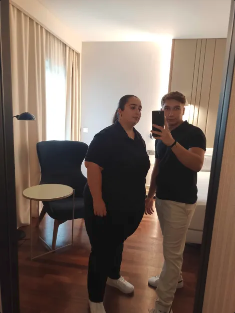
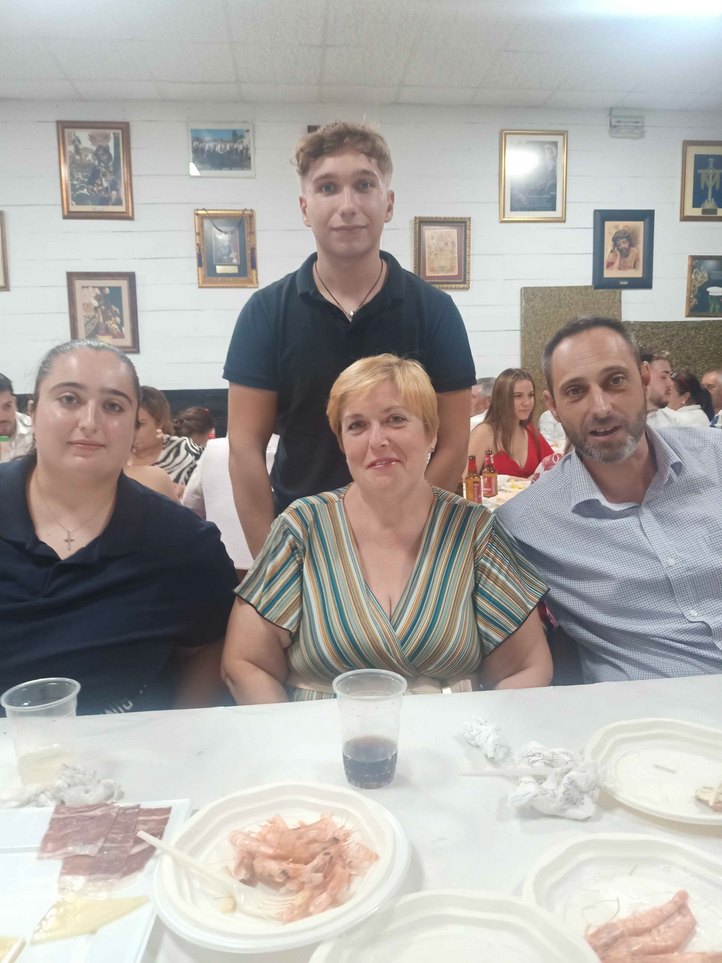
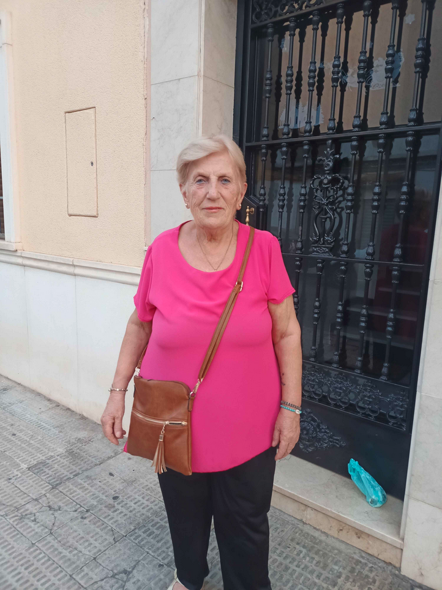

# Sobre mí
En este pequeño archivo para la asignatura ``Lenguajes de marcas y sistemas de gestión de información`` voy a tratar de que me conozcas un poco más sobre mí. Abordaré sobre los diferentes temas:

- **Datos personales**
- **Gustos**
- **Qué me dedico en mi tiempo libre**
  
## Datos personales
Me llamo Saúl Ruiz Plaza, nací en **Córdoba (España)** el 1 de Julio de 2006, es decir, tengo **18 años**. Vivo en Calle Hermano Juan Fernandez número 15 1-2.

Tengo una hermana mayor que yo, se llama Rocío, tiene 22 años, actualmente está estudiando ***Técnico Superior en Transporte y Logística*** en **[IES GÓNGORA](https://www.google.com/maps/place//data=!4m2!3m1!1s0xd6cdf7cd11e62c1:0x961f1753c15740ac?sa=X&ved=1t:8290&ictx=111)**.

----
Mi familia es carismatica, mi madre se llama **Teresa**, tiene 44 años, es una mujer espectacular. La quiero mucho

Mi padre se llama **José**, va a cumplir el mes que viene 48 años, le tengo mucho aprecio ya que es un hombre muy listo.

---
Ahora toca hablar de unas de las mujeres más importantes de mi vida, mi abuela, se llama **Valle**, tiene 77 años. A pesar de su gran lucha a lo largo de la vida, siempre me recibe todos los días con una gran sonrisa. Sin los valores que me ha aportado mi abuela, no sería el chico que soy hoy en día. Ella siempre me dice:

> Saúl, tienes que estudiar mucho para tener una buena vida

## Gustos

- Tengo un gran gusto al **deporte.** 
  - me gusta entrenar con mi pareja, solemos ir **5 veces por semana**

- Tambien me gusta **leer.**
  - Mi libro favorito es ***No me puedes lastimar*** de **David Goggings**.
  - Mi cita favorita es: 
     > Tienes que aprender muy bien las bases, si no entiendes algo no te irá bien la asignatura.

- Me hace mucha ilusión aprender diferentes **Idiomas.**
  - Me encanta hablar con otras personas en diferentes idiomas. Presento un **B2 en Inglés y Francés**.

## A qué me dedico en mi tiempo libro

Siempre me he caracterizado por ser una persona perfeccionista, quiero que salga todo **perfecto**. Para ello me gusta crearme objetivos para saber que estoy **siendo produtivo**, en este año he logrado lo siguiente:

- [x] B2 Inglés
- [x] B2 Francés
- [x] Teórico Coche
- [x] 95 kilos Press de Banca
- [x] Pasar más tiempo con mi familia
- [x] Estirar 30 días seguidos
  

Actualmente tengo otros retos

- [ ] Tener media 8 ASIR
  - Mi correo corporativo es **<a24ruplsa@iesgrancapitan.org>**
- [ ] Poder hacer 10 dominadas con 10 kilos de Lastre
- [ ] Correr 10 kilometros en 50 minutos.
- [ ] Aprender fotografía
- [ ] Aprobar examen práctico permiso B

## Despedida
Espero que le haya gustado este pequeño archivo que he realizado con mucho amor, tengo buenas expectativas para este año, realmente estoy estudiando algo que me gusta.

